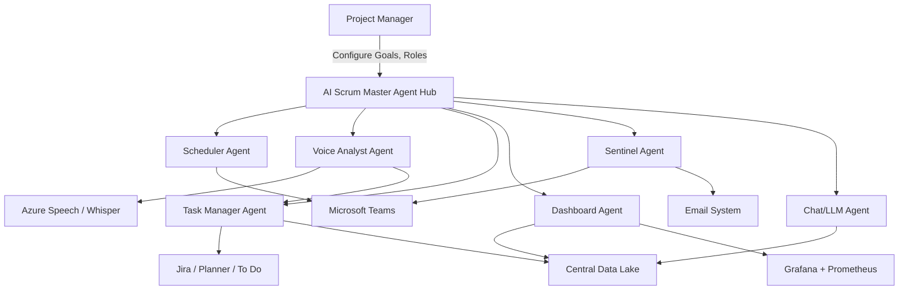
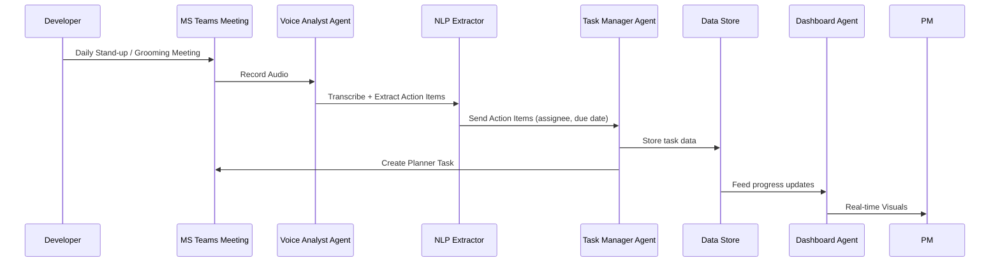
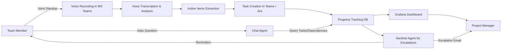

# AI Scrum Master Agent Proposal

# 1. Objective

To build an AI-powered Scrum Master Agent for each scrum team in a project that can autonomously handle key scrum responsibilities, enhance team collaboration, improve productivity visibility, and proactively manage risk and performance.

---

# 2. Key Responsibilities of the AI Scrum Master Agent

## 2.1 Scrum Event Management

- Schedule sprint planning, grooming, daily stand-ups, retrospectives, bug triaging.
    
- Integrate with Microsoft Teams Calendar using Microsoft Graph API.
    

## 2.2 Intelligent Collaboration

- Analyze voice in MS Teams meetings to extract action items for various roles (SA, BA/PO, QA, Dev, PM).
    
- Create tasks in Microsoft Teams Planner/To Do based on extracted insights.
    

## 2.3 Real-time Monitoring and Dashboarding

- Aggregate task progress and completion data.
    
- Create and update real-time Grafana dashboards.
    
- Trigger escalations if progress stalls.
    

## 2.4 Configuration and Customization

- Allow configuration of:
    
    - Team goals and sprint timelines
        
    - Member roles and responsibilities
        
    - Escalation levels and matrices
        

## 2.5 Predictive and Proactive AI Features

- Predict task delays and potential blockers.
    
- Respond to team queries regarding ownership, dependencies, and process guidance.
    
- Provide feedback and appreciations based on performance trends.
    

---

# 3. Architecture Overview

## 3.1 Multi-Agent Microservice Architecture

- **Scheduler Agent**: Manages scrum calendars
    
- **Voice Analyst Agent**: Transcribes and processes voice
    
- **Task Manager Agent**: Manages task creation, updates
    
- **Dashboard Agent**: Feeds data into Grafana
    
- **Sentinel Agent**: Real-time monitoring and escalation
    
- **Chat Agent**: Q&A for team queries, powered by LLM
    

## 3.2 Integration Points

- Microsoft Teams & Graph API
    
- Azure Speech Services / Whisper AI
    
- Microsoft Planner / Jira
    
- Prometheus/InfluxDB for metrics
    
- Grafana for visualization
    
- Email/Slack for escalations
    

---

# 4. Data Flow

1. **Team Meeting** in MS Teams
    
2. **Voice Recording** via Bot Framework
    
3. **Transcription** via Azure Speech
    
4. **Action Item Extraction** using NLP (spaCy/Hugging Face)
    
5. **Task Creation** in Teams Planner or Jira
    
6. **Progress Monitoring** via API Polling/Webhooks
    
7. **Data Storage** in centralized DB or Data Lake
    
8. **Dashboard Update** in Grafana
    
9. **Escalation** via MS Teams bot and Email
    

---

# 5. Technology Stack

|Component|Tech Stack Options|
|---|---|
|Voice Analysis|Azure Speech, Whisper AI|
|NLP Processing|spaCy, Haystack, Hugging Face Transformers|
|Task Management|Microsoft Planner API, Jira REST API|
|Dashboards|Grafana + Prometheus/InfluxDB|
|Communication Platform|Microsoft Teams + Graph API|
|Escalation Layer|MS Teams Bot, Email API|
|AI/LLM Agent|OpenAI GPT-4, Claude, Flan-T5|
|Hosting|Azure, AWS Lambda, GCP Functions|

---

# 6. Roadmap (MVP First)

**Phase 1**: MVP

- Single team integration
    
- Schedule standups + meeting transcription + task creation
    
- Manual dashboard updates
    

**Phase 2**: Automation

- Automated task extraction and progress tracking
    
- Real-time Grafana dashboards
    
- Basic escalation logic
    

**Phase 3**: Advanced AI Agent

- Predictive analysis
    
- Chat-based interaction + Q&A
    
- Team sentiment and health tracking
    
- Appreciation and feedback modules
    

---

# 7. Benefits

- Improved meeting outcomes
    
- Fewer dropped tasks and delays
    
- Proactive issue detection and resolution
    
- Scalable across multiple scrum teams
    
- Increased visibility and accountability for PMs
    

---

# 8. Next Steps

1. Review and approve MVP plan.
    
2. Assign team for prototype development.
    
3. Prepare required API access and cloud setup.
    

---

# 9. Diagrams (To be created)

- **Architecture Diagram**

- **Data Flow Diagram**

- **User Interaction Flow**

# 10. Implementation References

https://github.com/openai/openai-cs-agents-demo
