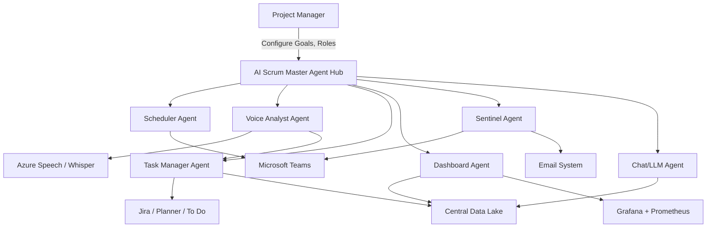
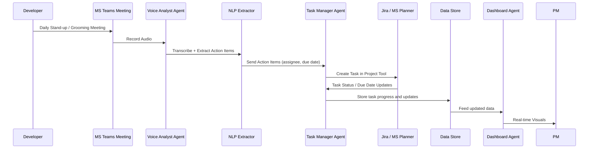
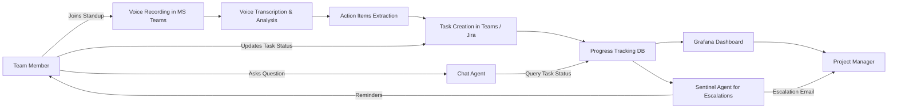

# 🤖 AI Scrum Master Agent Proposal

## 🎯 Objective
To build a production-grade AI-powered Scrum Master Agent that automates coordination tasks for each scrum team, integrates with collaboration tools like MS Teams and Jira, and provides real-time visibility to the Project Manager via dashboards.

---

## 🧩 Key Features & Requirements

### ✅ Core Responsibilities
1. **Schedule Scrum Ceremonies**: Sprint planning, grooming, daily standups, retrospectives, and triaging.
2. **Voice & Chat Analysis**: Transcribe MS Teams meeting voice; use NLP to extract action items.
3. **Task Creation**: Create and assign tasks in MS Teams (Planner), Jira, or other PM tools based on conversations.
4. **Progress Tracking**: Monitor task status and due dates in real-time from MS Teams or Jira to measure progress.
5. **Dashboards**: Feed structured data into Grafana to visualize sprint health and team metrics.
6. **Real-time Monitoring & Escalation**: Trigger reminders or email escalations when tasks stall or miss deadlines.
7. **Chat Assistant**: Answer team queries, provide contact points, task statuses, and suggest mitigations.
8. **Predictive Feedback**: Offer data-driven feedback and highlight potential blockers to the Project Manager.
9. **Host for Scrum Calls**: Agent can optionally act as the call host or use a bot runner via Teams to record and monitor.
10. **Configurable Team Setup**: Set goals, members, roles, levels, sprint cadence, and escalation matrix.
11. **Security & Compliance**: Role-based access control, audit logs, GDPR and ISO compliance.
    

---

# 3. Architecture Overview

## 3.1 Multi-Agent Microservice Architecture

- **Scheduler Agent**: Manages scrum calendars
    
- **Voice Analyst Agent**: Transcribes and processes voice
    
- **Task Manager Agent**: Manages task creation, updates
    
- **Dashboard Agent**: Feeds data into Grafana
    
- **Sentinel Agent**: Real-time monitoring and escalation
    
- **Chat Agent**: Q&A for team queries, powered by LLM
    

## 3.2 Integration Points

- Microsoft Teams & Graph API
    
- Azure Speech Services / Whisper AI
    
- Microsoft Planner / Jira
    
- Prometheus/InfluxDB for metrics
    
- Grafana for visualization
    
- Email/Slack for escalations
    

---

# 4. Data Flow

1. **Team Meeting** in MS Teams
    
2. **Voice Recording** via Bot Framework
    
3. **Transcription** via Azure Speech
    
4. **Action Item Extraction** using NLP (spaCy/Hugging Face)
    
5. **Task Creation** in Teams Planner or Jira
    
6. **Progress Monitoring** via API Polling/Webhooks
    
7. **Data Storage** in centralized DB or Data Lake
    
8. **Dashboard Update** in Grafana
    
9. **Escalation** via MS Teams bot and Email
    

---

# 5. Technology Stack

|Component|Tech Stack Options|
|---|---|
|Voice Analysis|Azure Speech, Whisper AI|
|NLP Processing|spaCy, Haystack, Hugging Face Transformers|
|Task Management|Microsoft Planner API, Jira REST API|
|Dashboards|Grafana + Prometheus/InfluxDB|
|Communication Platform|Microsoft Teams + Graph API|
|Escalation Layer|MS Teams Bot, Email API|
|AI/LLM Agent|OpenAI GPT-4, Claude, Flan-T5|
|Hosting|Azure, AWS Lambda, GCP Functions|

---

## 🧠 Team Structure

| Role | Count | Skills Needed | Responsibilities |
|------|-------|----------------|------------------|
| **AI/ML Engineer** | 2 | Python, NLP (spaCy/Hugging Face), speech-to-text (Whisper/Azure), LLM fine-tuning | Voice-to-task pipeline, feedback analysis, Q&A agent |
| **Backend Engineer** | 2 | Node.js/Java/Python, REST APIs, microservices, auth, async comms | Agent services, task manager, DB layer, APIs |
| **Frontend Engineer** | 1 | React/Angular, UI/UX, real-time dashboards, Microsoft Teams UI extensions | Admin config panel, dashboards |
| **DevOps Engineer** | 1 | Docker, Kubernetes, CI/CD, Azure/AWS | Deployment, monitoring, scalability |
| **MS 365/Teams Developer** | 1 | MS Graph API, Teams Bot Framework, Planner API, Webhooks | Teams bot, task syncing |
| **Solution Architect** | 1 | Cloud & microservices architecture | Design, reviews, governance |
| **Project Manager** | 1 | Agile project management | Planning, reporting, tracking |
| **QA / Test Automation** | 1 | Manual + automated testing, API, voice flow testing | QA cycles, validation, regression testing |

---

# 6. Roadmap (MVP First)

**Phase 1**: MVP

- Single team integration
    
- Schedule standups + meeting transcription + task creation
    
- Manual dashboard updates
    

**Phase 2**: Automation

- Automated task extraction and progress tracking
    
- Real-time Grafana dashboards
    
- Basic escalation logic
    

**Phase 3**: Advanced AI Agent

- Predictive analysis
    
- Chat-based interaction + Q&A
    
- Team sentiment and health tracking
    
- Appreciation and feedback modules
    

---

# 7. Benefits

- Improved meeting outcomes
    
- Fewer dropped tasks and delays
    
- Proactive issue detection and resolution
    
- Scalable across multiple scrum teams
    
- Increased visibility and accountability for PMs
    

---

# 8. Next Steps

1. Review and approve MVP plan.
    
2. Assign team for prototype development.
    
3. Prepare required API access and cloud setup.
    

---

# 9. Diagrams

- **Architecture Diagram**

- **Data Flow Diagram**

- **User Interaction Flow**

